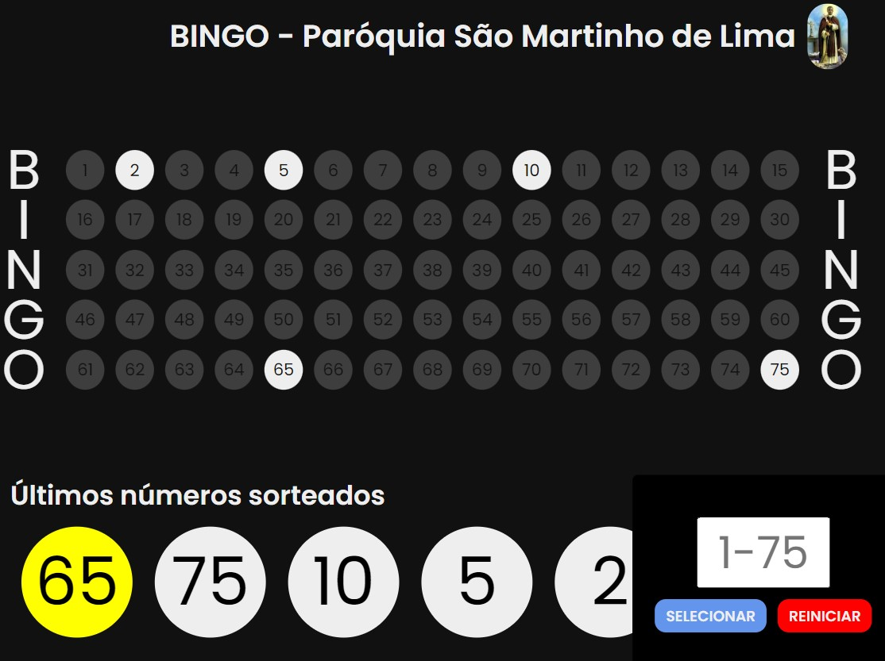

# BINGO FÁCIL

Sistema para marcação manual de números sorteados em bingo, desenvolvido para a Paróquia São Martinho de Lima do bairro Cajuru, Curitiba-PR.

Desenvolvido com :
- HTML
- CSS
- JAVASCRIPT

Faz a marcação visual de todos os números na tela, diferenciando os que já foram sorteados, assim como a listagem dos últimos números. 

*Responsivo para telas como o tamanho mínimo de 800x600. 

Deploy: 
https://lucianoneo.github.io/bingo/
